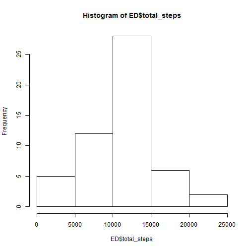
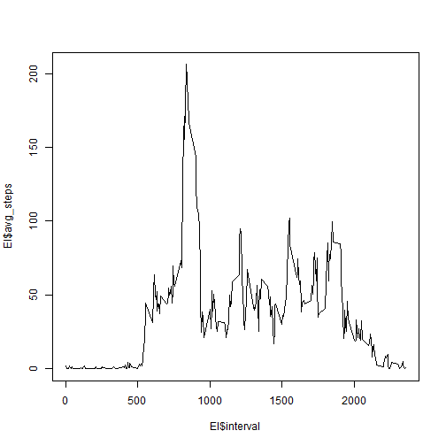
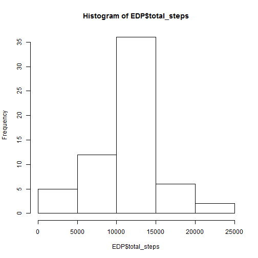

## Loading and preprocessing the data


```r
##  read in the data
A <- read.csv("activity.csv")
##  identify the rows without NA
B <- !is.na(A$steps)
##  create a dataframe without those rows
C <- A[B,]
## Use the plyr library ddply function to get average steps per day
library(plyr)
##  create a dataframe with total number of steps per day
ED <- ddply(C, .(date), summarize, total_steps = sum(steps))
##  create a dataframe with average average number of steps per interval
EI <- ddply(C, .(interval), summarize, avg_steps = mean(steps))
```

## What is mean total number of steps taken per day?


```r
hist(ED$total_steps)
```

 

```r
print("Mean is:")
```

```
## [1] "Mean is:"
```

```r
mean(ED$total_steps)
```

```
## [1] 10766.19
```

```r
print("Median is:")
```

```
## [1] "Median is:"
```

```r
median(ED$total_steps)
```

```
## [1] 10765
```

## What is the average daily activity pattern?

```r
plot(EI$interval, EI$avg_steps, type = "l")
```

 

```r
max_steps = max(EI$avg_steps)
print("Maximum number of steps on interal number:")
```

```
## [1] "Maximum number of steps on interal number:"
```

```r
EI[EI$avg_steps == max_steps,]$interval
```

```
## [1] 835
```


## Imputing missing values


```r
##  compute number of rows with NA
print ("Number of rows with NAs is:")
```

```
## [1] "Number of rows with NAs is:"
```

```r
sum(is.na(A$steps))
```

```
## [1] 2304
```

```r
##  simplest strategy is just to replace each NA with overall mean number of steps
AP <- A
AP[!B, ]$steps <- mean(C$steps)
EDP <- ddply(AP, .(date), summarize, total_steps = sum(steps))
hist(EDP$total_steps)
```

 

```r
print("Mean is:")
```

```
## [1] "Mean is:"
```

```r
mean(EDP$total_steps)
```

```
## [1] 10766.19
```

```r
print("Median is:")
```

```
## [1] "Median is:"
```

```r
median(EDP$total_steps)
```

```
## [1] 10766.19
```

### The mean was unchanged but the median did change.

## Are there differences in activity patterns between weekdays and weekends?
